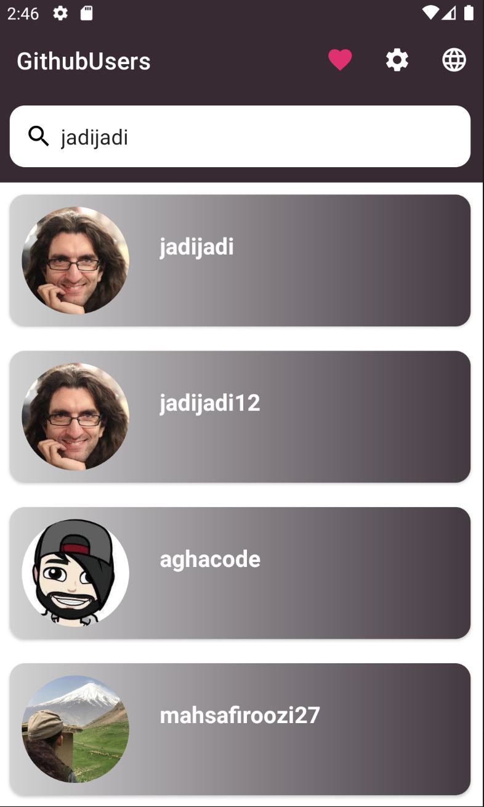

# Owlestic Code Challenge
App is an Android application that allows users to search for Github users and add them to their favorites list.
Features

    * Search for Github users by their username
    * View user details including their avatar, username, name, bio, and number of followers and following
    * Add users to the favorites list
    * Remove users from the favorites list
    * View a list of favorite users
    * Offline support with a local Room database

# Screenshots

  
  
   

# Installation

To run the app, follow these steps:

    * Clone the repository
    * Open the project in Android Studio
    * Build and run the app on your device or emulator
Or:
<a>https://github.com/u3frajaeian/Owlestic/releases/tag/v1.0.0</a>

# Technologies Used

The app is developed using the following technologies:

    * Kotlin - the main programming language used
    * MVVM - the architectural pattern used for separating UI and business logic
    * Android Jetpack - a collection of libraries used for building Android apps
    * Room - a persistence library used for local database storage
    * Hilt - a dependency injection library used for managing dependencies
    * Retrofit - a networking library used for making API calls
    * Glide - an image loading and caching library used for loading images from network
    

